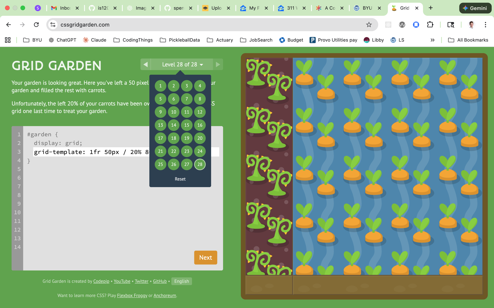
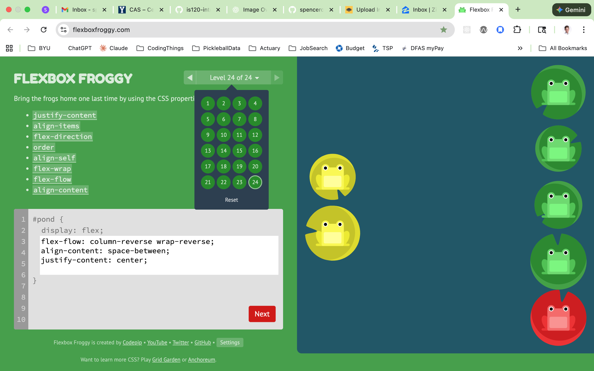

# is120-hw6-Spencer-Kimball

**To Do:**

* Build a single web page using CSS Grid for page layout and CSS Flexbox for individual component structure. Use any topic or filler content you like.
- Use `grid-template-areas` to define four named areas: `header`, `main`, `sidebar`, `footer`.
- Use `grid-template` to control the sizing of these areas.
- Use Flexbox in your `header` for navigation links and a page title.
- Use Flexbox in your `main` to arrange 3 cards. The cards should use Flexbox internally as well.
- Use Flexbox in your `sidebar` to stack additional links vertically.
- Use Flexbox in your `footer` to display your name and the date for this assignment on opposite ends of the `footer`.

* Explain the difference between Flexbox and Grid. What use cases is each one better suited for?
* Do you like Flexbox or Grid better? Why?
* Publish using GitHub pages and include the live URL in your repo about section. Submit the GitHub repo URL in LearningSuite.

**Completed**
SURVEY COMPLETED!

**Completed Grid Garden**

**Completed Flexbox Froggy**

